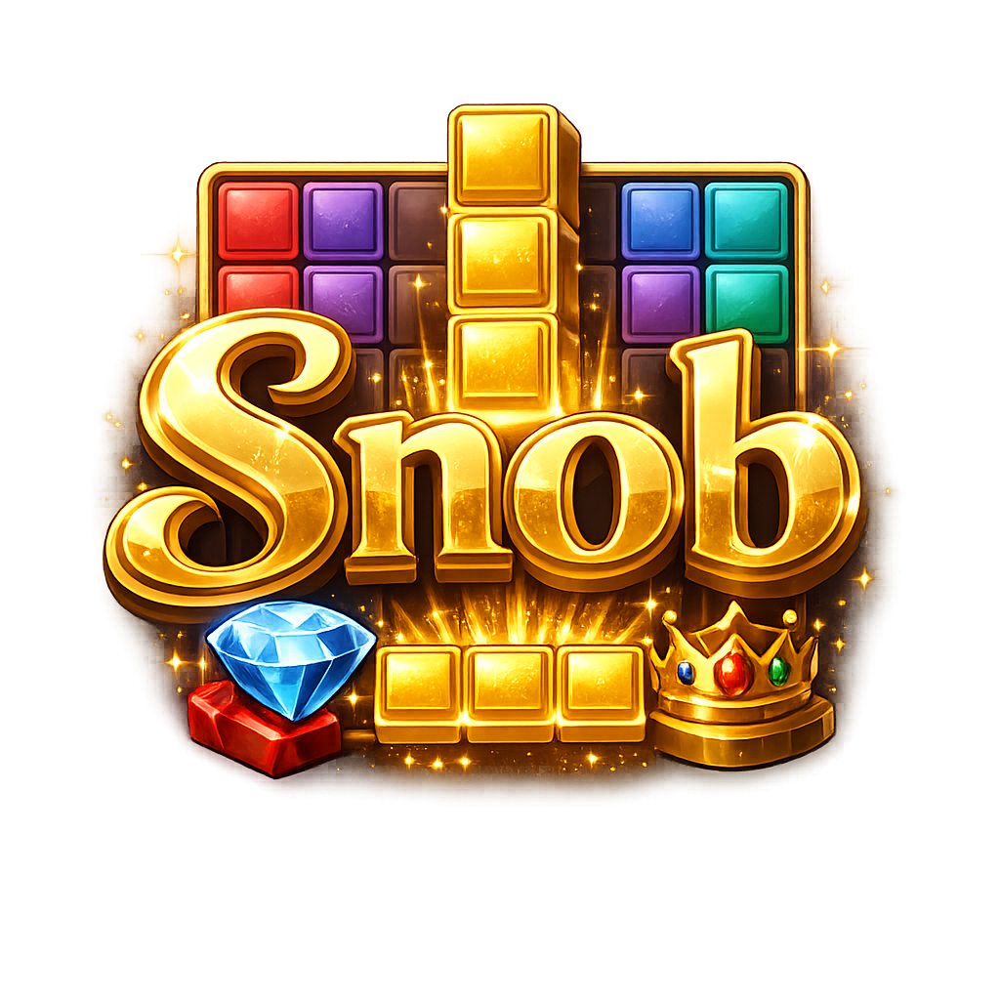

<div align="center">
  
  
  # 🎩 SNOB — Édition Prestige 💎
  
  **L'expérience ultime de Block Blast revisitée pour les esthètes du puzzle.**
  
  [](https://nextjs.org/)
  [](https://tailwindcss.com/)
  [](https://www.typescriptlang.org/)
  [](https://firebase.google.com/)
</div>

---

## 🌟 Présentation

**Snob** est un jeu de puzzle de blocs de prestige, alliant un design ultra-fluide et moderne à des mécaniques de jeu profondément revisitées. L'interface sombre et élégante est magnifiée par des effets de particules magiques, des micro-animations délicates (propulsées par `motion`) et des coloris HSL sophistiqués.

Que vous soyez un joueur occasionnel cherchant la détente ou un stratège en quête du score parfait, **Snob** saura vous captiver grâce à ses multiples modes de jeu, son économie riche et ses cosmétiques prestigieux.

---

## 🎮 Mécaniques de Jeu : Le Block Blast Tactique 🔄

Le gameplay classique de Block Blast a été sublimé pour offrir de réelles options tactiques :

*   **🧱 Grille 8x8 :** Placez vos blocs avec minutie sur une grille élégante et sombre.
*   **🔄 Rotation des Blocs (Rotate) :** Ne subissez plus la fatalité des formes imposées ! Tournez vos blocs à 90° d'un simple clic pour trouver l'emplacement parfait.
*   **📥 La Réserve (Hold) :** Conservez précieusement un bloc dans votre zone de réserve pour le déployer au moment le plus opportun.
*   **🎲 Reroll de Prestige :** Vos blocs en main ne vous plaisent pas ? Dépensez **50 SP** (Snob Points) pour relancer l'intégralité de votre main de blocs !
*   **🔥 Multiplicateurs & Combos :** Effacez plusieurs lignes et/ou colonnes simultanément pour déclencher des effets de particules éblouissants et des multiplicateurs de score démultipliés.

---

## 🕹️ Modes de Jeu

Trois modes de jeu distincts s'offrent à vous pour tester vos compétences :

### 🏆 Mode Classique
Pas de chronomètre, pas de pression. Le pur plaisir du puzzle de blocs. Maximisez votre score, gérez vos pièces et tentez de battre votre record personnel (sauvegardé sur votre profil).

### 🎯 Mode Campagne (100 Niveaux)
Parcourez une campagne de **100 niveaux progressifs**. Chaque niveau propose un type d'objectif unique et est récompensé par un système allant jusqu'à **3 étoiles** :
1.  **LIGNES :** Détruire un nombre cible de lignes (ex: Niveau 1 = 5 lignes, Niveau 20 = 100 lignes).
2.  **SCORE :** Atteindre un score cible (ex: Niveau 1 = 1 000 points, Niveau 50 = 50 000 points).
3.  **SURVIE :** Survivre à un nombre précis de tours sans être bloqué.

### ⚡ Mode Blitz (Contre-la-montre)
Un défi frénétique de **120 secondes**. Le chronomètre défile, mais chaque ligne ou colonne que vous effacez vous rajoute **2 secondes** de temps supplémentaire (dans la limite des 120s initiales). Soyez rapide et précis !

---

## 👑 Snob Pass & Progression de Prestige

### Le Système d'XP et de Niveaux
Chaque action en jeu et chaque quête complétée vous rapporte de l'XP. Monter de niveau vous octroie de précieux **SP** et débloque de nouvelles fonctionnalités.

### Rangs de Prestige (Prestige Ranks)
Une fois le **Niveau 100** atteint, vous pouvez choisir de faire table rase et de réaliser un **Prestige**. Votre niveau et votre XP sont réinitialisés à 1, mais vous montez dans la hiérarchie de la haute société avec 10 grades de prestige exclusifs :

| Rang | Niveau Requis | Badge de Prestige |
| :--- | :---: | :---: |
| **Sans prestige** | - | - |
| 🥉 **Bronze** | 100 | Prestige 1 |
| 🥈 **Argent** | 100 | Prestige 2 |
| 🥇 **Or** | 100 | Prestige 3 |
| 💎 **Platine** | 100 | Prestige 4 |
| 💠 **Diamant** | 100 | Prestige 5 |
| 🔮 **Maître** | 100 | Prestige 6 |
| 👑 **Grand Maître** | 100 | Prestige 7 |
| ⚡ **Plasma** | 100 | Prestige 8 |
| 🌌 **Matière Noire** | 100 | Prestige 9 |
| ☄️ **Cosmique** | 100 | Prestige 10 |

### 📜 Quêtes de Prestige
Le jeu propose des défis pour accumuler des SP et de l'XP :
*   **Quêtes Quotidiennes :** 3 quêtes réinitialisées chaque jour à minuit.
*   **Quêtes Hebdomadaires :** Défis plus longs et ardus. Vous pouvez relancer une quête hebdomadaire qui ne vous convient pas contre **50 SP**.

### 🎫 Snob Pass (Saison 1 : Nuit Cyber)
Le Snob Pass est un pass saisonnier comprenant **20 paliers** de récompenses prestigieuses à débloquer en accumulant de l'XP de saison. Il contient du SP, des boosters d'XP, des gadgets exclusifs, ainsi que la traînée légendaire **Cyber Flux** et le skin de prestige **Cyber Néon (S1)**.

---

## 🛍️ Boutique de Prestige & Cosmétiques

Personnalisez l'apparence de votre jeu grâce aux **SP** accumulés ou en tentant votre chance dans les **Mystery Boxes** !

### 🎨 Les Skins de Blocs (17 Skins)

Modifiez l'apparence visuelle des blocs de votre grille :

| Visuel | Nom | Rareté | Prix | Description |
| :---: | :--- | :--- | :---: | :--- |
| 🟦 | Classique | Commun | Gratuit | Style de base indémodable aux couleurs éclatantes. |
| 🌸 | Néon Rose | Rare | 500 SP | Ambiance Vaporwave et cyberpunk fluorescente. |
| 🌊 | Abysse Marin | Rare | 800 SP | Nuances aquatiques et d'écume marine des profondeurs. |
| 💻 | Code Terminal | Rare | 1 200 SP | Vert phosphore rétro-éclairé façon console de hacker. |
| 🌲 | Forêt Féérique | Épique | 1 800 SP | Couleurs sylvestres mystiques de mousse et de fleurs. |
| 🏆 | Or Impérial | Épique | 2 500 SP | Nuances dorées et cuivrées scintillantes de prestige. |
| 🤖 | Néon Cyber | Épique | 3 200 SP | Couleurs chromatiques à haute tension du futur. |
| 🔥 | Noyau Magma | Épique | 4 000 SP | Éruptions de lave volcanique rougeoyante et chaude. |
| ❄️ | Glace Éternelle | Légendaire | 5 000 SP | Blocs gelés incassables à l'éclat cristallin. |
| 🌌 | Trou Noir | Légendaire | 6 500 SP | Nuances cosmiques et d'obsidienne stellaire. |
| 🌠 | Aube Cosmique | Légendaire | 8 000 SP | Blocs cosmiques dorés et stellaires somptueux. |
| 🌌 | Aurore Boréale | Légendaire | 7 500 SP | Dégradés mystiques de verts, turquoises et violets. |
| 🌈 | Rêve Arc-en-Ciel | Légendaire | 9 000 SP | Spectre lumineux complet vibrant d'énergie céleste. |
| 🌇 | Éclat du Couchant | Épique | 6 000 SP | Dégradés chauds d'oranges, corails et roses profonds. |
| 🌌 | Nébuleuse Violette | Légendaire | 8 500 SP | Tourbillon d'indigo, violet électrique et pourpre. |
| 🏍️ | Cyber Néon (S1) | Légendaire | Snob Pass | Vitesse et lumière d'un futur urbain électrique. |
| 🌇 | Synthwave | Épique | 4 500 SP | Nostalgie des années 80 dans une matrice numérique. |

### ✨ Traînées de Particules / VFX (8 Effets)

Un sillage visuel magique suit votre bloc lorsque vous le faites glisser vers la grille :

*   🚫 **Sans Effet :** Glissement classique sans artifice.
*   ✨ **Étincelles Dorées (Rare - 600 SP) :** Sillage d'étoiles magiques et de paillettes scintillantes.
*   💻 **Flux Binaire (Rare - 1 200 SP) :** Chiffres informatiques verts fluorescents (0/1) qui s'écoulent.
*   🔥 **Sillage de Feu (Épique - 1 800 SP) :** Braises ardentes et étincelles de lave chaude.
*   🌌 **Halo Cosmique (Épique - 2 500 SP) :** Poussière de nébuleuse violette et gaz spatiaux mystiques.
*   🌈 **Sillage Arc-en-Ciel (Légendaire - 4 500 SP) :** Explosion chromatique multicolore dégradée.
*   📟 **Cyber Flux (S1) (Légendaire - Snob Pass) :** Pluie numérique de codes directement issue de la matrice.
*   ⚡ **Plasma Synth (Épique - 3 200 SP) :** Traînées de plasma ionisé à haute fréquence.

### ⚙️ Gadgets Tactiques

Achetez et stockez des consommables pour vous aider dans vos parties les plus difficiles :
*   🔄 **Rotation Tactique (Rare - 200 SP) :** Permet de pivoter un bloc en cours de partie.
*   📥 **Case de Réserve (Épique - 400 SP) :** Utilisation temporaire du Hold.
*   🎲 **Reroll de Prestige (Rare - 300 SP) :** Relancer la main courante.
*   🔫 **Blaster Néon (Épique - Snob Pass) :** Détruit instantanément un bloc unique sur la grille.
*   ⏱️ **Gel Temporel (Légendaire - Snob Pass) :** Gèle le chronomètre pendant 5 secondes (très utile en mode Blitz !).

---

## 📊 Profil, Statistiques & Badges

Votre **Profil de Joueur** est le reflet de votre excellence. Il regroupe :
*   Vos statistiques globales : parties jouées, score maximal, niveau, prestige, quêtes complétées.
*   Un graphique interactif (propulsé par `recharts`) représentant l'évolution de vos scores sur vos dernières parties.
*   Vos badges de réussite sociale débloqués :

| Badge | Type | Condition |
| :---: | :--- | :--- |
| 🌱 | **Snob en Herbe** | Posséder 500 SP |
| 🎨 | **Amateur d'Art** | Posséder au moins 3 skins différents |
| 🎩 | **Grand Bourgeois** | Posséder 2 500 SP |
| 💼 | **Dandy Chic** | Posséder au moins 5 skins différents |
| 🏰 | **Aristocrate** | Posséder 6 000 SP |
| 🏺 | **Mécène Royal** | Posséder au moins 8 skins différents |
| 👑 | **Monarque Absolu** | Posséder 10 000 SP |
| 🌌 | **Maître de Collection** | Posséder 11 skins différents |
| ☄️ | **Légende Cosmique** | Avoir effectué au moins 1 Prestige |

---

## ⌨️ Raccourcis Clavier

Naviguez instantanément dans les salons de l'application grâce à nos raccourcis clavier dédiés :
*   `C` : Mode **Classic**
*   `A` : Mode **Campagne** (Adventure)
*   `B` : Mode **Blitz**
*   `Q` : Onglet **Quêtes**
*   `P` : Onglet **Profil**
*   `I` : Onglet **Inventaire**
*   `S` : Boutique (**Shop**)

---

## 💻 Lancer le Projet en Local

### Prérequis
*   [Node.js](https://nodejs.org/) (Version 22 recommandée)
*   [pnpm](https://pnpm.io/) ou `npm` pour la gestion des paquets.

### Installation & Lancement

1.  **Installer les dépendances :**
    ```bash
    pnpm install
    # ou
    npm install
    ```

2.  **Configurer les variables d'environnement :**
    Créez un fichier `.env.local` à la racine (ou dupliquez `.env.example`) et configurez vos clés d'accès (dont Firebase et Gemini) :
    ```env
    GEMINI_API_KEY=votre_cle_api_gemini
    ```

3.  **Lancer le serveur de développement :**
    ```bash
    pnpm dev
    # ou
    npm run dev
    ```

4.  **Accéder à l'application :**
    Ouvrez [http://localhost:3000](http://localhost:3000) dans votre navigateur.

---

<div align="center">
  <p>Créé avec passion et raffinement pour les amateurs de défis intellectuels d'élite. 🎩✨</p>
</div>
